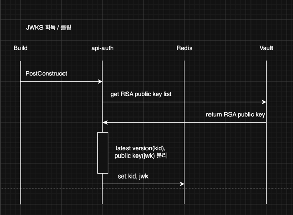
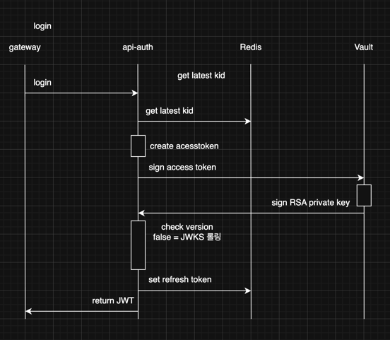
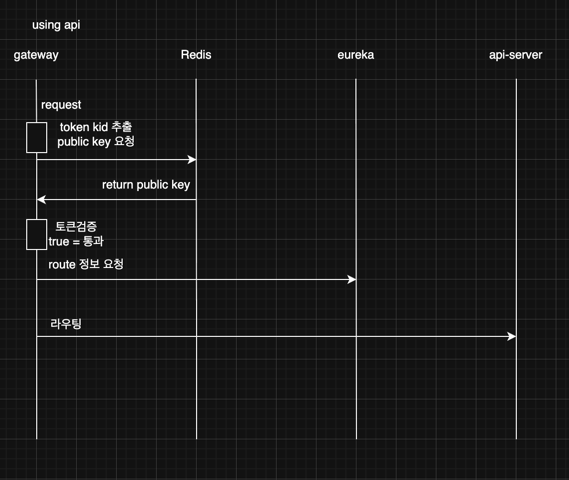
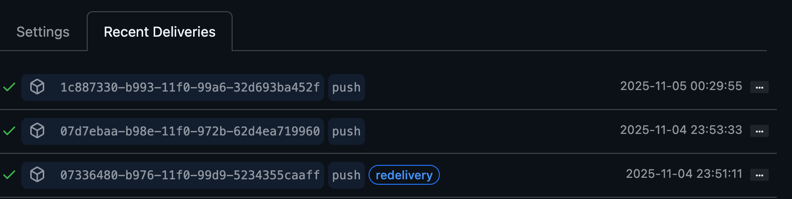
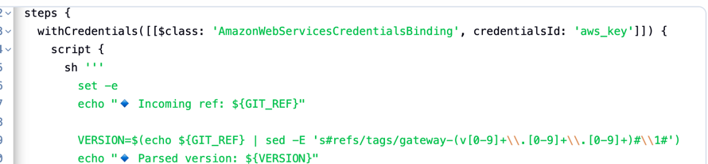
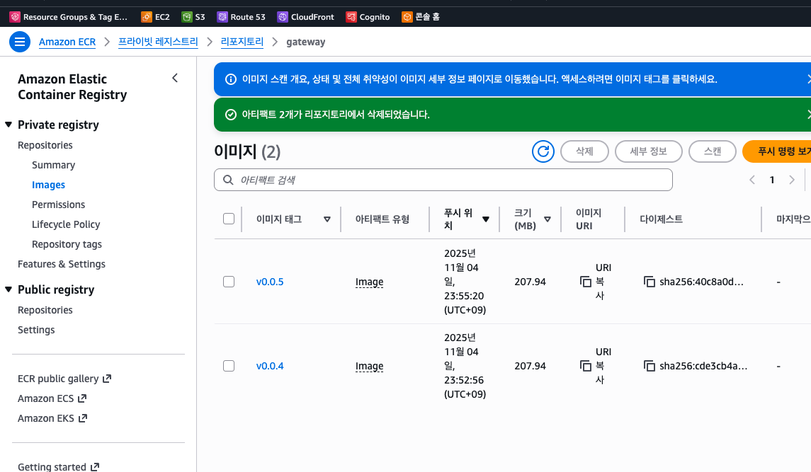
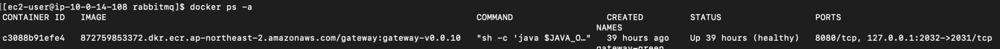
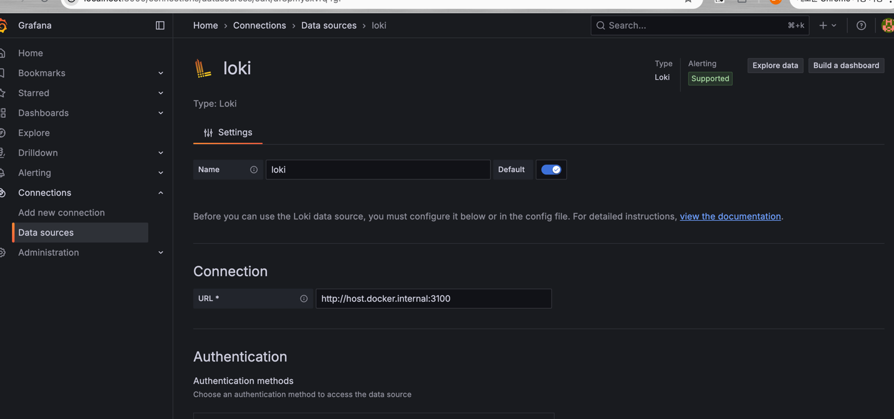
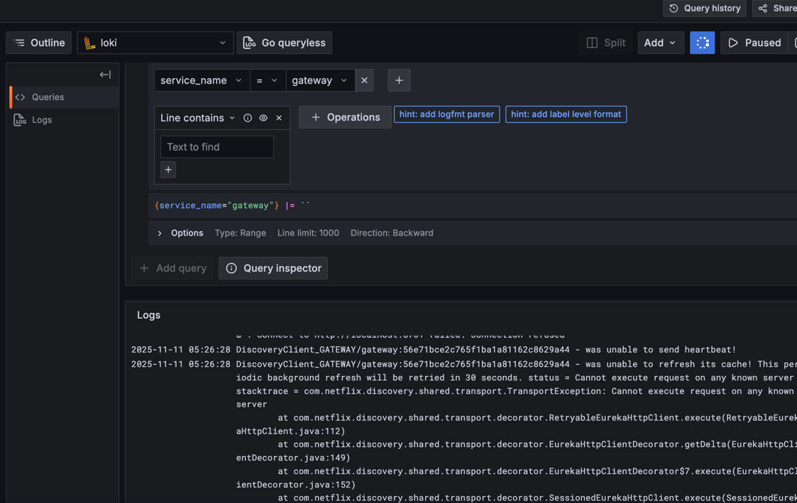

## 본프로젝트는 회사에서 사용하던 기능들을
## 최소비용으로 구축해보는 프로잭트입니다.

#### 실제 운영에선 안정성을위해 vault는 사용하지 않았으며
#### aws kms비용 절감과 vault transit 특성을 학습하기 위한 프로젝트입니다.


본 프로젝트는 Spring Boot 3.5.0 / Java 17 기반의 Request–Response Oriented MSA 애플리케이션으로,  
모노리포(Gradle Import) 구조를 사용하며   
각 서비스는 독립적으로 배포/확장 가능하며, 도메인 단위로 분리되어 있다.  
향후 트래픽 증가 및 비동기 처리 요구에 따라 Kafka 또는 Pulsar 기반의 Event-driven 구조로 확장할 수 있다.  
<details><summary>프로젝트 설명 </summary>

## 1. 패키지 구조

<details> <summary>package</summary>

/api-{domain} → 각 마이크로서비스(API)  controller, facade  
/batch-{domain} → 배치 처리 서비스  
/gateway → 외부 진입 게이트웨이  
/eureka → 서비스 디스커버리 서버  
/lib-common → 공통 유틸, 예외, 응답 포맷, 상수  
/lib-model → service, entity, repo, spec, DTO, Enum, VO  
/lib-webflux → 공통 WebFlux 설정 및 필터  
/lib-legacy → 레거시 호환 라이브러리  
/util-codegen → DB 스키마 기반 코드 생성 유틸리티  
/images → README용 캡처 및 다이어그램 리소스  
</details>

## 2. DB 설계 규칙
<details> <summary>db</summary>

- 모든 테이블은 `id (BIGINT, AUTO_INCREMENT)` 형태의 **대리키(Surrogate Key)** 사용
- 비즈니스 키(자연키)는 Unique Index로만 관리
- 서비스별 **데이터 소유권 원칙** 유지 (조인 금지, 교차조회는 API로 수행)
- 스키마 변경 시 `version` 필드 및 **낙관적 락(Optimistic Lock)** 사용
</details>

## 3. 코드 네이밍 규칙

<details> <summary>common code</summary>

- **Prefix 기반 계층형 비즈니스 코드 체계**
    - 예: `C1FT000REP` → Prefix(`C1FT`) + Sequence(`000`) + Identifier(`REP`)
    - 도메인/타입/세부 식별자로 구성된 Structured Business Code Convention 적용
    - Enum + BizErrorException 조합으로 타입 안정성 확보
</details>

## 4. HTTP 응답 규칙

<details> <summary>http envelope</summary>

- **Response Envelope Pattern** 적용
- HTTP 상태코드와 애플리케이션 상태코드를 분리

```json
{
  "httpStatus": 200,
  "responseType": "SUCCESS",
  "message": "정상 처리되었습니다.",
  "data": {},
  "timestamp": "2025-10-18T23:00:00Z"
}
```

</details>

## 5. 데이터 접근 규칙

<details> <summary>데이터 접근 규칙</summary>

표준 페이징/정렬: JPA 스펙 그대로 사용 (page, size, sort=field,ASC|DESC)  

단순 처리 (CRUD, 페이징) → JPA

복잡한 조회/필터/통계 쿼리 → QueryDSL

UNION 등 복합 SQL 처리 → Spring 3.x JdbcClient

외부 리소스 연동 트랜잭션 → Facade(orchestration) 계층에서 조립
</details>

## 6. SAGA (보상 트랜잭션)

<details> <summary>saga</summary>

REST API 기반 보상 트랜잭션 방식 사용

WebFlux Facade Orchestrator가 각 단계 호출/보상 제어

Kafka/Temporal 의존성 없이 HTTP로 Command/Compensation 처리

실패 시 보상 트랜잭션 REST 호출 및 saga_state 테이블에 상태 저장

예시

정상: Order → Payment → Inventory → Shipping

보상: Inventory 실패 → Payment 취소 → Order 취소

설계 원칙

각 서비스는 보상용 REST API 제공 (util-codejen 규칙으로 자동생성 필요한 보상은 별도 개발)

WebClient timeout, retryWhen 사용 (Resilience4j 미사용)
</details>

## 7. 인증 및 Vault 연동 (Vault, JWK 롤링)
<details> <summary>정보보호</summary>
<summary>api-auth README 보기</summary>

[README.md](api-auth/README.md)  
  
  
  

</details>

## 8. JPA 트랜잭션 규칙

<details> <summary>트랜잭션</summary>

단순 트랜잭션: JPA 처리 우선

외부 호출이 필요한 경우: Facade에서 조립 및 트랜잭션 경계 관리

복잡한 조합: QueryDSL

고급 SQL (UNION, 복잡 조인 등): JdbcClient 사용

</details>

## 9. API 버전 정책

<details> <summary>api version rule</summary>

버저닝은 URL 버전(v1, v2) 대신 도메인 단위 분리 방식을 채택한다.
DB 스키마나 엔티티 구조가 변경될 경우 기존 API를 유지한 채 신규 도메인 API를 생성하고,
구버전은 Deprecation 공지를 통해 단계적으로 제거한다.


</details>

## 10. MSA 운영 규칙

<details> <summary>MSA rule</summary>

Eureka 기반 서비스 디스커버리

Gateway 라우팅: lb://service-name

헬스체크 URL: /actuator/health

내부 통신: Service ID 기반 호출

HTTP 표준 응답은 Response Envelope으로 통일

각 서비스는 독립 DB 보유 (데이터 소유권 원칙)

API는 단일 책임 원칙, 교차 호출은 Facade 또는 Gateway 경유

시간/타임존: UTC+0 기준, 시간은 front에서 user의 국가를 기반으로 시간계산.

낙관적 락을 통해 스키마 진화 시 충돌 방지

</details>

## 11. util-codejen (유틸 코드 제너레이터) 규칙
<details>
<summary>util-codejen README</summary>

[README.md](util-codegen/README.md)
</details>


## 12. Ingest & Fan-out 구조 (확장 설계)

<details> <summary>event driven</summary>

게이트웨이 및 Facade는 모든 외부 요청을 **Ingest Layer**로 수집한다.  
이 레이어는 추후 wenflux Orchestrator로변경하며, Kafka, Redis Stream, 또는 HTTP 비동기 큐 기반의 **Fan-out 구조**로 확장될 수 있다.

- **Ingest Layer**
    - 모든 외부 요청/이벤트/로그를 통합 수집하는 진입점
    - Saga 및 REST 트랜잭션 흐름 이전 단계에서 데이터 검증/필터링 수행

- **Fan-out Pattern**
    - 단일 요청을 여러 서비스로 비동기 분배
    - 예: 주문 생성 → `Order`, `Inventory`, `Notification` 서비스 병렬 전달
    - Outbox 또는 Event Gateway 기반 확장 가능
    - 이 프로젝트는 기본적으로 REST 기반 트랜잭션(보상 SAGA)을 채택한다.
      이벤트 드리븐 아키텍처는 쓰기·팬아웃·비동기 허용이 커지는 도메인에서만 선택적으로 적용한다.
      향후 필요 시 Outbox→메시지 브로커(Kafka/Pulsar)로 확장하는 하이브리드 구조를 지원한다.

</details>

## 13. 블루그린 & 점진적 블루그린 
## (Blue-Green / Progressive Blue-Green) 배포 전략
<details>
<summary>ci/cd</summary>

점진적 블루그린을 롤링으로 사용
대상서버 (gateway)
이 구조는 **AWS EC2 + Docker Compose + Nginx + Jenkins** 기반에서 운영되며,  
배포 상태 관리는 **3가지 상태(`lock`, `blue`, `green`)** 만으로 단순화합니다.

| 상태 | 설명 |
|------|------|
| **lock** | 현재 배포 중(스위치/전환 중), 다른 배포 금지 |
| **blue** | 현재 블루 세트가 트래픽 처리 중 (활성 상태) |
| **green** | 현재 그린 세트가 트래픽 처리 중 (활성 상태) |


### 구조 예시

| 세트 | 컨테이너 | 포트 |
|------|-----------|------|
| Blue | gateway-blue-1 | 8081 |
| Blue | gateway-blue-2 | 8082 |
| Green | gateway-green-1 | 8083 |
| Green | gateway-green-2 | 8084 |

### 장점
- **1대 서버에서도 무중단 가능**
- 실제로는 롤링처럼 점진 교체되지만, 관리 상태는 Blue/Green 2세트로 단순화
- 롤백도 한 번의 업스트림 교체로 끝

### 단점
- 리소스는 일시적으로 2배 필요
- 포트/컨테이너명 관리 규칙 필요

### ci/cd 분리
ci -> git tag 웹훅 -> jenkins -> ssm / ecr   



cd -> ssm / ecr -> 배포 -> nginx 변경


argoCd 배포 (gateway/eureka 외 서버)
ci -> git tag 웹훅 -> jenkins -> ssm / ecr -> value git pr
cd -> kuber -> argocd -> 클러스터배포

</details>


## 14. Observability
<details>
<summary>Observability</summary>

spring boot 4 마일스톤 2025년 7월 발표.   
https://github.com/spring-projects/spring-boot/wiki/Spring-Boot-4.0-Release-Notes
```text
spring cloud 마일스톤버전은
gateway, 스웨거등 의존성이 없고 boot와 자카르타 의존성이 많이 깨짐.
아직개발중..
기존 JAVAX -> jakarta 인터페이스 이름변경된거 다수존재.

Observability OTEL지원한다는 이야기가 있어 인프라 반영 예정
https://grafana.com/docs/loki/latest/send-data/otel/

https://github.com/spring-projects/spring-boot/wiki/Spring-Boot-4.0.0-M2-Release-Notes
A new starter, spring-boot-starter-opentelemetry has been added. This starter brings in all necessary dependencies to export metrics and traces over OTLP. It will also auto-configure the OpenTelemetry SDK.

Renamed Observability Modules
The following modules have been renamed:

spring-boot-metrics → spring-boot-micrometer-metrics

spring-boot-observation → spring-boot-micrometer-observation

spring-boot-tracing → spring-boot-micrometer-tracing

Each module’s root package has also been updated:

org.springframework.boot.metrics → org.springframework.boot.micrometer.metrics

org.springframework.boot.observation → org.springframework.boot.micrometer.observation

org.springframework.boot.tracing → org.springframework.boot.micrometer.tracing


```



SpringCloud Gateway -> otlp -> loki -> grafana example  
. 
SpringCloud Gateway -> otlp -> zipkin. 
. 
</details>
</details>

<details><summary>gateway jwks </summary>

vault 를사용한 RSA 암호화 JWT test   
gateway README   
[README.md](gateway/README.md)   
auth-api README  
[README.md](api-auth/README.md)  

</details>


<details><summary>api-auth jwks, vault transit</summary>

jwks 버전관리, 볼트연동, 암호화등  
[README.md](api-auth/README.md)
</details>


<details><summary>graphql-dgs</summary>

dgs gRPC 아키텍쳐  
graphql-dgs README  
[README.md](graphql-dgs-kt/README.md)

</details>
