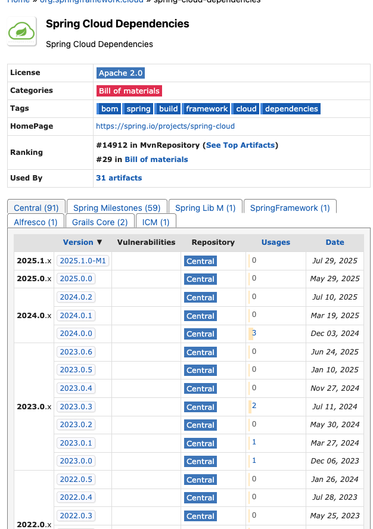
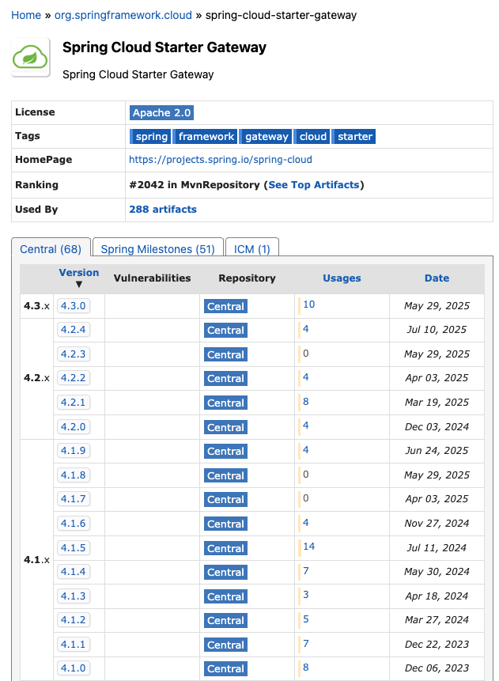

spring boot 4

```text
spring cloud 마일스톤버전은
gateway, 스웨거등 의존성이 없고 boot와 자카르타 의존성이 많이 깨짐.
아직개발중인거 같음
내 프로젝트 버전업 리팩토링은 나중에 가능할듯
```




본 프로젝트는 Spring Boot 3.5.0 / Java 17 기반의 MSA 애플리케이션으로,  
모노리포(Gradle Import) 구조를 사용하며 Gateway, Eureka, Vault, Redis, Kafka 등을 통합 관리한다.  
인프라 및 배포 관련 내용은 `infra/README.md`에서 별도 관리한다.

---

## 1. 패키지 구조
/api-{domain} → 각 마이크로서비스(API)
/batch-{domain} → 배치 처리 서비스
/gateway → 외부 진입 게이트웨이
/eureka → 서비스 디스커버리 서버
/lib-common → 공통 유틸, 예외, 응답 포맷, 상수
/lib-model → DTO, Enum, VO
/lib-webflux → 공통 WebFlux 설정 및 필터
/lib-legacy → 레거시 호환 라이브러리
/util-codegen → DB 스키마 기반 코드 생성 유틸리티
/images → README용 캡처 및 다이어그램 리소스

---

## 2. DB 설계 규칙

- 모든 테이블은 `id (BIGINT, AUTO_INCREMENT)` 형태의 **대리키(Surrogate Key)** 사용
- 비즈니스 키(자연키)는 Unique Index로만 관리
- 서비스별 **데이터 소유권 원칙** 유지 (조인 금지, 교차조회는 API로 수행)
- 스키마 변경 시 `version` 필드 및 **낙관적 락(Optimistic Lock)** 사용

---

## 3. 코드 네이밍 규칙

- **Prefix 기반 계층형 비즈니스 코드 체계**
    - 예: `C1FT000REP` → Prefix(`C1FT`) + Sequence(`000`) + Identifier(`REP`)
    - 도메인/타입/세부 식별자로 구성된 Structured Business Code Convention 적용
    - Enum + BizErrorException 조합으로 타입 안정성 확보

---

## 4. HTTP 응답 규칙

- **Response Envelope Pattern** 적용
- HTTP 상태코드와 애플리케이션 상태코드를 분리

```json
{
  "httpStatus": 200,
  "responseType": "SUCCESS",
  "message": "정상 처리되었습니다.",
  "data": {},
  "timestamp": "2025-10-18T23:00:00Z"
}
```
표준 페이징/정렬: JPA 스펙 그대로 사용 (page, size, sort=field,ASC|DESC)

5. 데이터 접근 규칙

단순 처리 (CRUD, 페이징) → JPA

복잡한 조회/필터/통계 쿼리 → QueryDSL

UNION 등 복합 SQL 처리 → Spring 3.x JdbcClient

외부 리소스 연동 트랜잭션 → Facade 계층에서 조립

6. SAGA (보상 트랜잭션)

REST API 기반 보상 트랜잭션 방식 사용

WebFlux Facade Orchestrator가 각 단계 호출/보상 제어

Kafka/Temporal 의존성 없이 HTTP로 Command/Compensation 처리

실패 시 보상 트랜잭션 REST 호출 및 saga_state 테이블에 상태 저장

예시

정상: Order → Payment → Inventory → Shipping

보상: Inventory 실패 → Payment 취소 → Order 취소

설계 원칙

각 서비스는 보상용 REST API 제공 (util-codejen 규칙으로 자동생성 필요한 보상은 별도 개발)

WebClient timeout, retryWhen 사용 (Resilience4j 미사용)
7. 인증 및 Vault 연동 (Vault, JWK 롤링은 추후 구현)

Spring Vault Transit 기반의 JWT 서명 및 JWKS 공개 예정

현재는 로컬 키 기반 서명으로 임시 운영 (JWK 롤링 구현 예정)

Vault는 KV/Transit 모두 사용하며, Config Server는 제외

8. JPA 트랜잭션 규칙

단순 트랜잭션: JPA 처리 우선

외부 호출이 필요한 경우: Facade에서 조립 및 트랜잭션 경계 관리

복잡한 조합: QueryDSL

고급 SQL (UNION, 복잡 조인 등): JdbcClient 사용

9. API 버전 정책

버저닝은 URL 버전(v1, v2) 대신 도메인 단위 분리 방식을 채택한다.
DB 스키마나 엔티티 구조가 변경될 경우 기존 API를 유지한 채 신규 도메인 API를 생성하고,
구버전은 Deprecation 공지를 통해 단계적으로 제거한다.

10. MSA 운영 규칙

Eureka 기반 서비스 디스커버리

Gateway 라우팅: lb://service-name

헬스체크 URL: /actuator/health

내부 통신: Service ID 기반 호출

HTTP 표준 응답은 Response Envelope으로 통일

각 서비스는 독립 DB 보유 (데이터 소유권 원칙)

API는 단일 책임 원칙, 교차 호출은 Facade 또는 Gateway 경유

시간/타임존: UTC+0 기준, ISO-8601 Z 포맷

낙관적 락을 통해 스키마 진화 시 충돌 방지

11. 유틸 코드 제너레이터 규칙

DB 스키마 조회 후 Controller, Service, Facade, Repository, Entity, JpaSpec 자동 생성

REST 엔드포인트 규칙:

메서드	경로	설명
GET	/	목록 조회
POST	/	생성
GET	/{id}	단건 조회
PUT	/{id}	수정
DELETE	/{id}	삭제
GET	/find-all	전체 조회
GET	/find-by-ids	다건 조회
DELETE	/delete-by-ids	다건 삭제
GET	/search-name	이름 기반 페이지 조회
GET	/find-all-name	이름 전체 조회

컨트롤러 프리픽스 예: @RequestMapping("/b4dd4878")