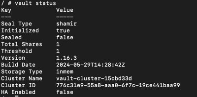
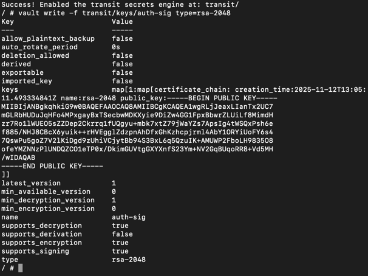
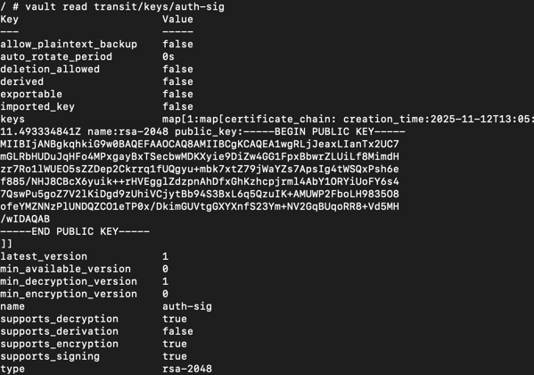
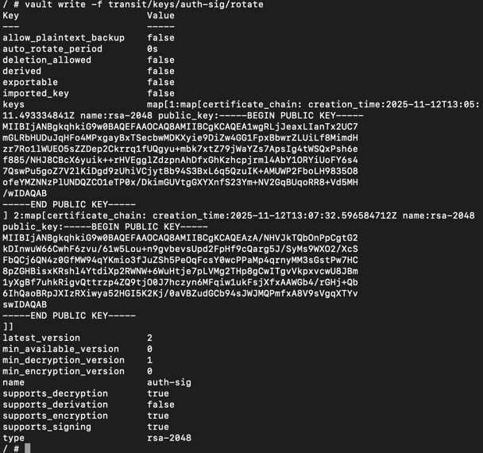
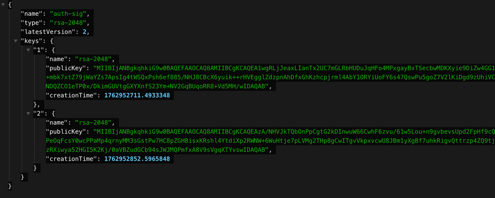

# Vault Transit 기반 JWT 키 관리 & 회전 시스템

> Origemite 인프라 표준 — Spring Auth / Gateway / Jenkins / AWS 기반  
> 보안·운영·DevSecOps 연동 Vault 설정 

---

##  1. 개요

이 문서는 **Vault Transit 엔진**을 사용하여
- JWT 서명 키를 안전하게 보관하고
- Auth 서버가 Vault를 통해 서명(JWT 발급)을 수행하며
- Jenkins 배치로 **자동 키 회전(Key Rotation)** 을 실행하는 구조를 정의한다.

**Vault는 절대 개인키를 외부로 노출하지 않으며**,  
Auth 서버는 Vault에서 공개키를 JWKS(JSON Web Key Set)로 변환해 Gateway에 제공한다.

<details> <summary>vault 명령어</summary>

| 목적          | 명령어                                                  |
| ----------- | ---------------------------------------------------- |
| 컨테이너 접속     | `docker exec -it vault sh`                           |
| Vault 상태 확인 | `vault status`                                       |
| Transit 활성화 | `vault secrets enable transit`                       |
| 키 생성        | `vault write -f transit/keys/auth-sig type=rsa-2048` |
| 키 조회        | `vault read transit/keys/auth-sig`                   |
| 키 회전        | `vault write -f transit/keys/auth-sig/rotate`        |
| 서명 테스트      | `vault write transit/sign/auth-sig input=<base64>`   |


```text
docker exec -it vault /bin/sh
# 컨테이너 쉘에서
export VAULT_ADDR=http://127.0.0.1:8200   
export VAULT_TOKEN=root                   

vault status
```

   



   

   

  

</details>

# 2. 솔트(Salt)와 사이퍼키(Cipher Key) 사용
<details>

솔트(Salt) — 비밀번호 보안용  
비밀번호를 해시할 때 사용하는 사용자별 랜덤 문자열  
DB 컬럼에 그대로 저장됨 (*_salt_key)  
비밀번호 검증을 위해 반드시 필요  
비밀번호 변경 시 새 솔트 생성  
역할: 비밀번호 해시를 더 안전하게 만드는 용도  

사이퍼키(Cipher Key) — 개인정보 암호화용  
Vault Transit에서 관리하는 암호화 전용 키  
DB에는 키의 ID만 저장 (cipher_key_id)  
실제 키는 서버가 절대 보지 않고 Vault만 보유  
이름/휴대폰/CI 같은 민감정보 암호화에 사용  
역할: 개인정보를 암호화/복호화하기 위한 Vault 전용 키  
</details>
