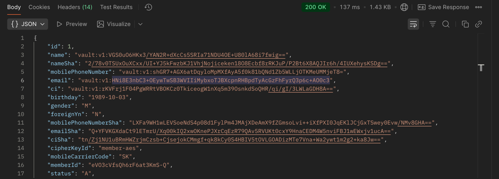
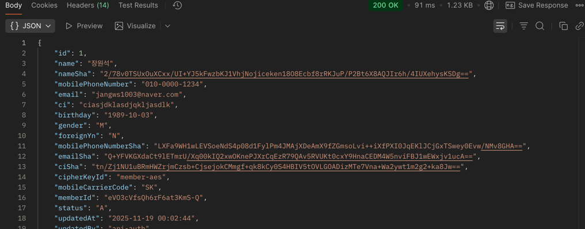

# Vault Transit 기반 JWT 키 관리 & 회전 시스템

> Origemite 인프라 표준 — Spring Auth / Gateway / Jenkins / AWS 기반  
> 보안·운영·DevSecOps 연동 Vault 설정 

---

##  1. 개요

이 문서는 **Vault Transit 엔진**을 사용하여
- JWT 서명 키를 안전하게 보관하고
- Auth 서버가 Vault를 통해 서명(JWT 발급)을 수행하며
- Jenkins 배치로 **자동 키 회전(Key Rotation)** 을 실행하는 구조를 정의한다.

1. JWT 인증 – RS256 (비대칭키)  
    - Auth 서버는 Vault에서 공개키를 JWKS(JSON Web Key Set)로 변환해 Gateway에 제공한다.  
       
2. 개인정보(Personal Data) 저장 – AES-256-GCM
    - JWT는 RSA지만,  
      개인정보 암호화는 RSA가 아니라 AES 대칭키로 처리해야 한다.  
      Vault Transit에서 AES 키를 생성하여  
      Encrypt / Decrypt vault로 요청하여 데이터 접근한다.  
   
3. 검색용 해시 컬럼 생성 - SHA-512 (PII 검색 지원)  
    - 개인정보는 암호화되면 “검색할 수 없기” 때문에  
      검색이 필요한 필드만 SHA-512 해시를 저장한다.  salt 미사용
    - password는 salt 사용
    - ci 봉투 암호화 사용 (envelope encryption)

# 암복호화 마스킹 예시
 <details> <summary>암복호화 마스킹 예시</summary>

일반조회   


마스킹 조회   


복호화 조회   


</details>


# vault 명령어
<details> <summary>vault 명령어</summary>

1. JWT 인증 – RS256 (비대칭키)
서명(Sign)
RSA Private Key → Vault Transit에서 관리
서버는 private key를 절대 보유하지 않음
JWT 서명은 Vault.transit.sign() 호출로만 생성됨
alg = RS256 (SHA-256 + PKCS1v1.5) 사용

검증(Verify)
RSA Public Key → Redis에 버전별 저장
JWT Header.kid = Vault Key Version
JJWT parser(RS256)로 검증 수행


| 목적          | 명령어                                                        |
|-------------|------------------------------------------------------------|
| 컨테이너 접속     | `docker exec -it vault sh`                                 |
| Vault 상태 확인 | `vault status`                                             |
| Transit 활성화 | `vault secrets enable transit`                             |
| rsa 키 생성    | `vault write -f transit/keys/auth-sig type=rsa-2048`       |
| rsa 키 조회    | `vault read transit/keys/auth-sig`                         |
| rsa 키 회전    | `vault write -f transit/keys/auth-sig/rotate`              |
| 서명 테스트      | `vault write transit/sign/auth-sig input=<base64>`         |
| aes 키 생성    | `vault write -f transit/keys/member-aes \ type=aes256-gcm96` |
| aes 키 조회    | `vault read transit/keys/member-aes`                       |

```text
docker exec -it vault /bin/sh
# 컨테이너 쉘에서
export VAULT_ADDR=http://127.0.0.1:8200   
export VAULT_TOKEN=root     
vault secrets list              
vault secrets enable transit
vault status
```

   


   

   

  

</details>

# ## Vault - JWT 키 관리 동작 흐름
<details>

1. 서버 시작 시 (init 메소드)
    - Vault Transit에서 `AUTH_JWT` 키 메타 정보를 조회한다.
    - 각 버전별 public key를 Redis에 저장한다.
        - 예) `AUTH_JWT:key:1`, `AUTH_JWT:key:2`, ...
    - Vault에서 내려준 `latest_version` 값을 Redis에 저장한다.
        - `LATEST_VERSION_KEY = {latest_version}`

2. 토큰 생성 시 (로그인 / 재발급 등)
    - Redis에서 `LATEST_VERSION_KEY` 를 조회하여 **가장 최신 버전 번호**를 가져온다.
    - 최신 버전에 해당하는 public/private key로 JWT를 생성한다.
    - JWT 헤더의 `kid` 에 해당 버전 번호를 설정한다.
        - 예) `kid = "3"`

3. 토큰 검증 시 (API 요청 처리)
    - JWT 헤더의 `kid` 값을 읽어서 버전 번호를 확인한다.
    - Redis에서 `AUTH_JWT:key:{kid}` 를 조회하여 해당 버전의 public key를 가져온다.
    - 가져온 public key로 서명을 검증한다.
</details>


# 솔트(Salt)와 사이퍼키(Cipher Key) 사용
<details>

솔트(Salt) — 비밀번호 보안용  
비밀번호를 해시할 때 사용하는 사용자별 랜덤 문자열  
DB 컬럼에 그대로 저장됨 (*_salt_key)  
비밀번호 검증을 위해 반드시 필요  
비밀번호 변경 시 새 솔트 생성  
역할: 비밀번호 해시를 더 안전하게 만드는 용도  

사이퍼키(Cipher Key) — 개인정보 암호화용  
Vault Transit에서 관리하는 암호화 전용 키  
DB에는 키의 ID만 저장 (cipher_key_id)  
실제 키는 서버가 절대 보지 않고 Vault만 보유  
이름/휴대폰/CI 같은 민감정보 암호화에 사용  
역할: 개인정보를 암호화/복호화하기 위한 Vault 전용 키  
</details>
