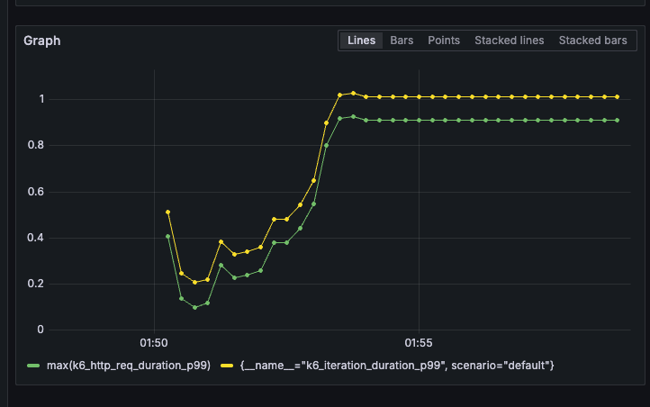
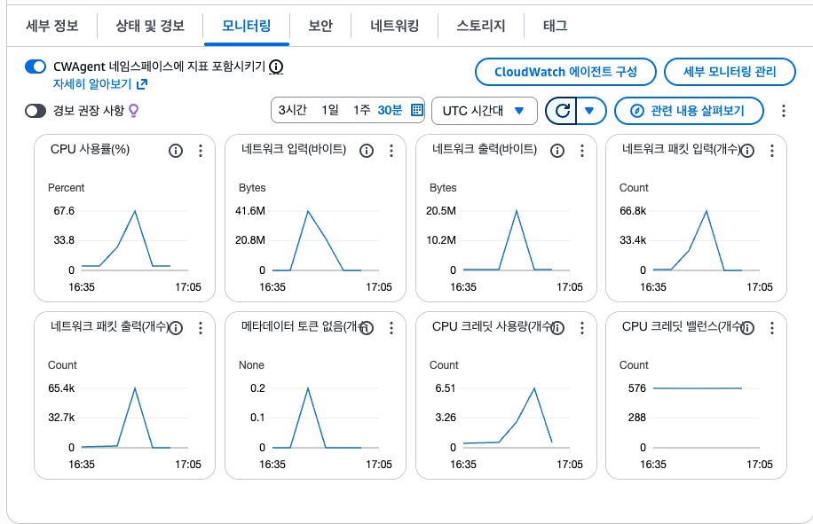
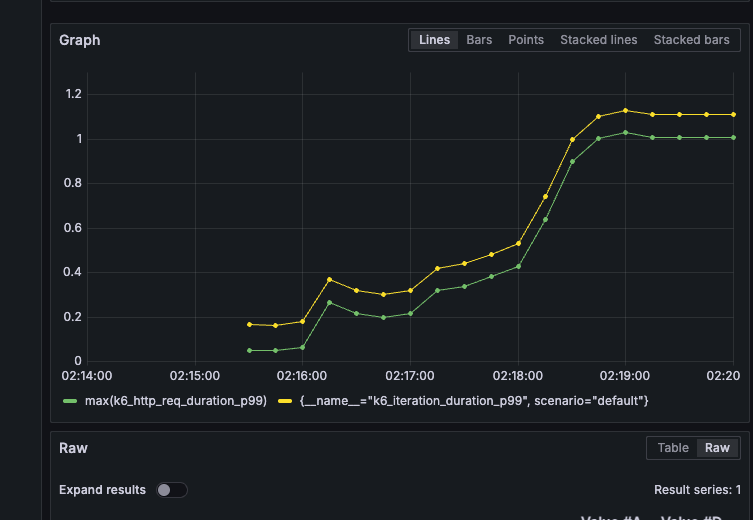
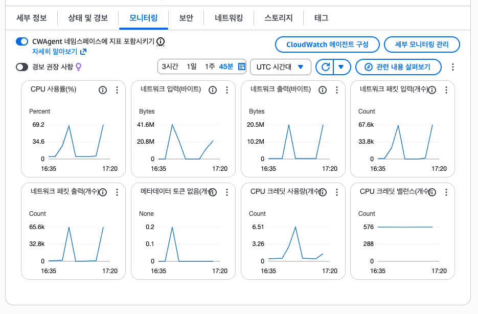
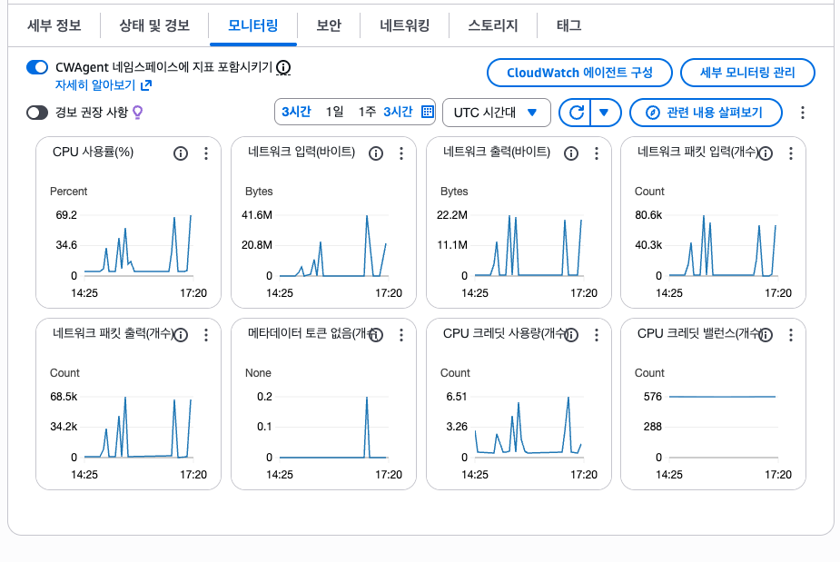

# Gateway 토큰 검증  

  

부하테스트 시나리오  
K6

 
k6
 
t3 미디엄에 모든 자원 프로세스들이 운영되고있는환경에서    
base line 설정  

base line

  
  
  
  
짧은 시간으로 테스트해보면 200~300구간에서  
시간이 급등함. 200이상은 지연시간이 늘어남    
200vu 구간에서 1분으로 시간을 늘려서 테스트실행   
cpu는 안정적  

베이스 최대 200vu로 테스트  
  
  

jwt rsa 검증 부하테스트 

  
   
   
   

50 -> 100vu 구간에서 시간 급증 cpu는 안정적
rsa 검증 로직을 간호화 할 필요가 있어보여서  
redis 에 access token을 ttl 처리하고 검증하는 로직으로 변경 필요해보임.

| 항목          | Baseline | RSA 검증     | 차이                   |
| ----------- | -------- | ---------- | -------------------- |
| avg latency | 20~60ms  | 80~150ms   | ↑ 3~5배 증가            |
| p95         | ~150ms   | ~300ms     | ↑ 2배                 |
| p99         | 0.2~0.8s | 0.8~1.2s   | ↑ 50~200%            |
| 안정 구간       | ~200 VU  | ~80 VU     | RSA bottleneck       |

redis 적용후  

  

rps가 오히려 떨어짐.  
레디스도 같은인스턴스여서 그런지 큰 성능 효과가 없음 
그리고 네트워크 io 효과가잇는듯함.  
서브넷 ip변경후에 테스트필요  
    
  
레디스를 서버 분리후 테스트해야 할 거 같음  
같은 인스턴스에선 오히려 cpu 자원 사용량이 늘어나서
성능효과 개선이 안보임.
  

cpu 사용량이 rsa 검증보다  
같은인스턴스 redis 사용시 54% -> 69% 급등  

네트워크는 외부 -> 서브넷ip 로변경후 네트워크 사용량 감소  
41mb -> 22mb  

통합 시나리오 테스트   
postman
