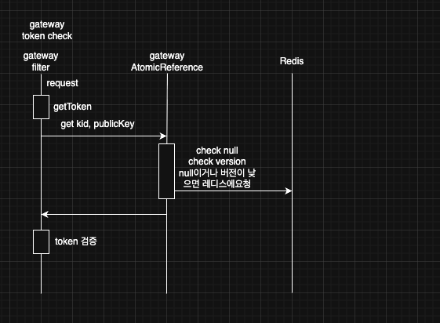
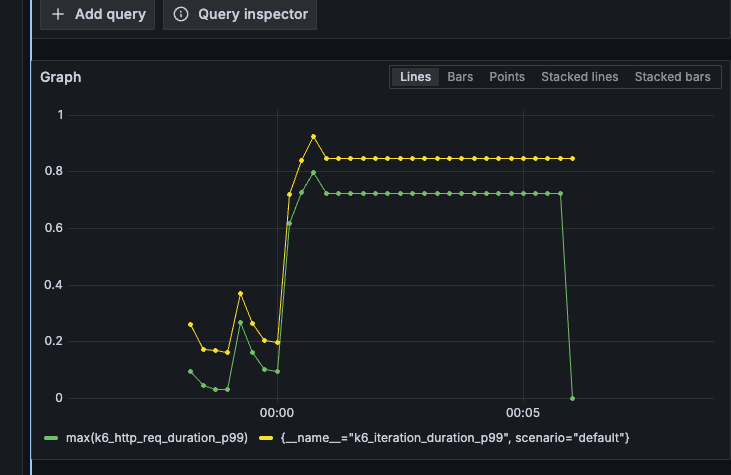
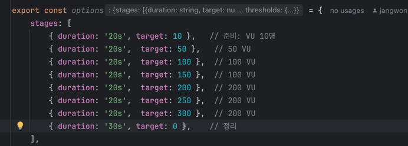
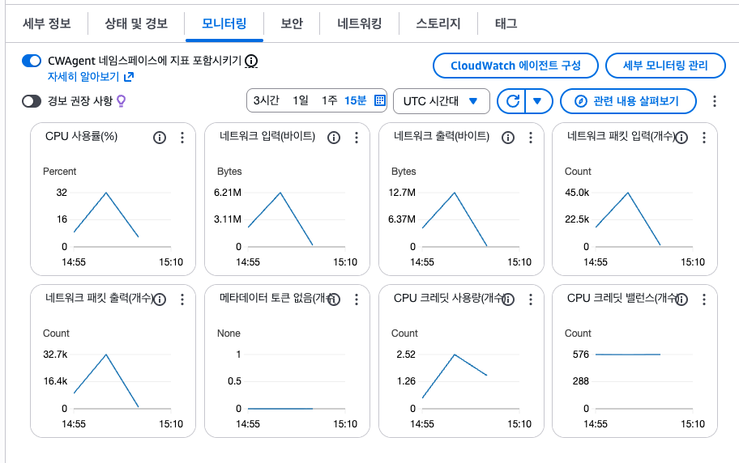
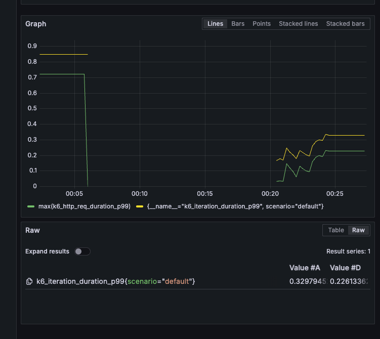
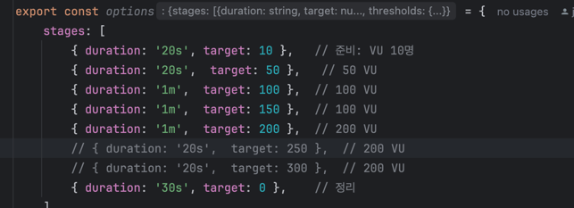
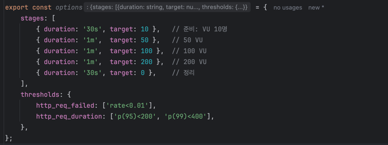
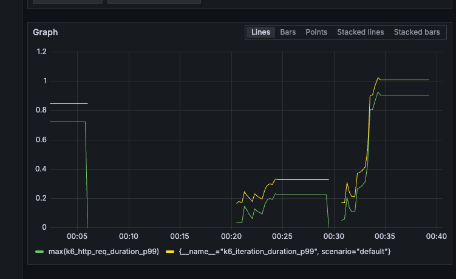
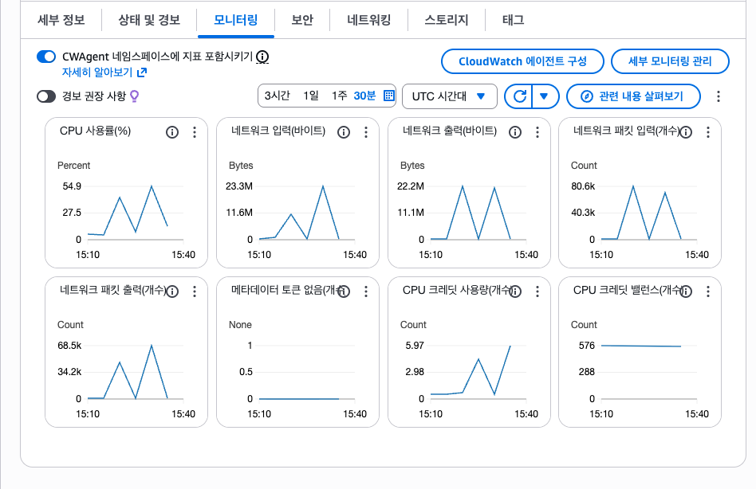

# Gateway 토큰 검증  

부하테스트 시나리오  
K6

 
k6

t3 미디엄에 모든 자원 프로세스들이 운영되고있는환경에서  
base line 설정

base line

  
  
  
  
짧은 시간으로 테스트해보면 200~300구간에서  
시간이 급등함. 200이상은 지연시간이 늘어남    
200vu 구간에서 1분으로 시간을 늘려서 테스트실행  
cpu는 안정적

베이스 최대 200vu로 테스트
  
  

jwt rsa 검증 부하테스트 

   
   
  

50 -> 100vu 구간에서 시간 급증 cpu는 안정적
rsa 검증 로직을 간호화 할 필요가 있어보여서  
redis 에 access token을 ttl 처리하고 검증하는 로직으로 변경 필요해보임.

통합 시나리오 테스트   
postman
