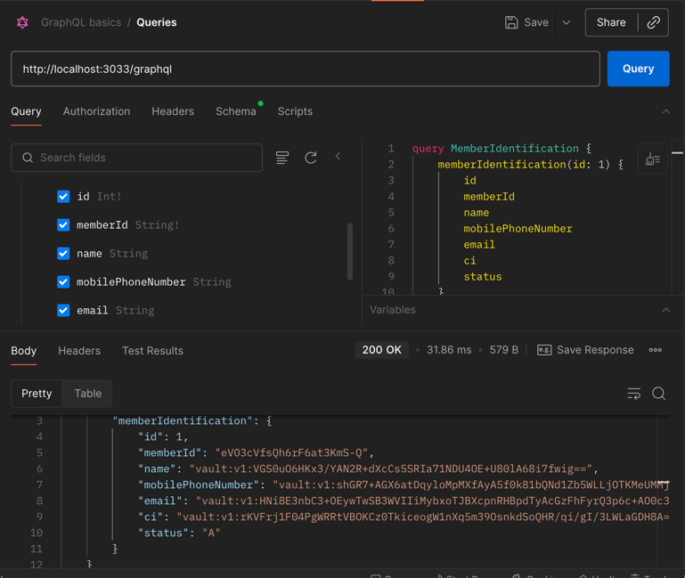
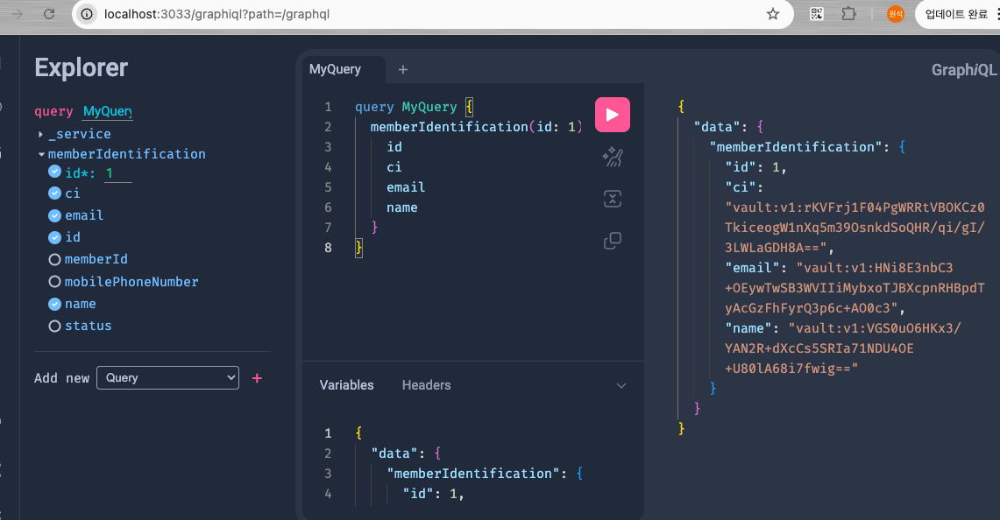

# 본 프로젝트는 netflex dgs 학습 프로젝트 입니다.

https://github.com/Netflix/dgs-framework/blob/master/graphql-dgs-client/build.gradle.kts

Domain Graph Service

netflix    
https://youtu.be/XpunFFS-n8I  
단순 gc 업그레이드만으로 성능20%향상     
넷플릭스가 rxJava(webflux)를 사용안하는 이유, 처리방법

우리팀에서의 이유는 리소스 부족 및 안정성  
넷플릭스 리소스 낭비 / 안정성과 속도를 dgs 로 개선.

## REST api 와 gRPC 차이

 rest vs grpc 

- REST:
  - 사람 읽기 좋은 대신, 네트워크 + CPU 사용량 증가
  - N개의 마이크로서비스 REST 호출 = 네트워크 홉·헤더 오버헤드 N배
- gRPC:
  - 같은 호출 구조라도 **패킷 크기/레이턴시가 훨씬 작음**
  - 서버-서버 내부 통신에 적합

   

## java, gRPC 데이터타입

data type
  

| Java Type | Proto Type | 설명         |
| --------- | ---------- | ---------- |
| `int`     | `int32`    | 32비트 정수    |
| `long`    | `int64`    | 64비트 정수    |
| `boolean` | `bool`     | true/false |
| `double`  | `double`   | 64비트 부동소수  |
| `float`   | `float`    | 32비트 부동소수  |
| `String`  | `string`   | UTF-8 문자열  |
| `byte[]`  | `bytes`    | 바이너리 데이터   |

   

## gRPC 패턴

gRPC 패턴 
  

- Unary RPC  
  일반적인 Request/Response 1:1 통신, REST 1:1 대응

- Server Streaming  
  클라이언트 1번 요청, 서버가 여러 Response 스트림으로 내려줌  
  예: 긴 목록/로그 스트리밍, 리포트 처리 진행 상황

- Client Streaming  
  클라이언트가 여러 요청을 스트림으로 보내고, 서버가 마지막에 1개의 응답  
  예: 센서 데이터 업로드, 배치성 업로드

- Bidirectional Streaming  
  양쪽 모두 스트림, 채팅/실시간 피드/알림 등에서 사용

  

## 서버구성

 서버구성 

draw.io로 작성필요  
nginx  
gateway   
eureka  
grpc  
api-auth

  

## Netflex dgs 흐름

dgs 흐름 

  

## 쿼리정책

 
 Query 
 

- 최대 쿼리 깊이(`maxDepth`) : **6**
    - `query -> root field -> ... -> leaf` 기준
- 한 요청에서 조회 가능한 **최대 노드 수**: 약 **1,000 노드** 수준을 목표로 한다.
    - 페이지네이션 필수(`first`, `after` 형태)
- 필수 필드만 조회하도록 클라이언트에 요구한다.
    - "모든 필드 다 가져오기" 용도로 GraphQL을 사용하지 않는다.

- 전체 쿼리 코스트 합이 `1000`을 넘으면 거절한다.
- 기본 페이지네이션 규칙
    - `first` / `last` 의 최대 값은 `50`
    - `first` 값이 클수록 cost 가 비례해서 증가한다. (예: `first = 50`인 리스트 필드 cost = `50 * childCost`)

## EndPoint, URL 규칙

 
 Cost 

POST /graphql/dgs-api        - 메인 GraphQL 엔드포인트
GET  /graphql/schema         - SDL 스키마 다운로드 (internal only)
GET  /graphql/playground     - GraphiQL / DGS Playground (local/dev only)

- GraphQL은 **조회(Read) 전용 BFF 레이어**로 사용한다.
    - `query`만 허용, `mutation`/`subscription`은 사용하지 않는다.
    - 쓰기(Write)는 REST/gRPC BlockingStub 서비스로 분리한다. (CQRS 목적)

## Error log 규칙

 
 Error 
 

## Graphql 사용법

 
 Postman Graphql 사용 
 

postman  
  

graphiql  
http://{ipport}/graphiql  
  

## Test 성능테스트

 
 테스트 

아파치 벤치마킹  
ghz
k6

